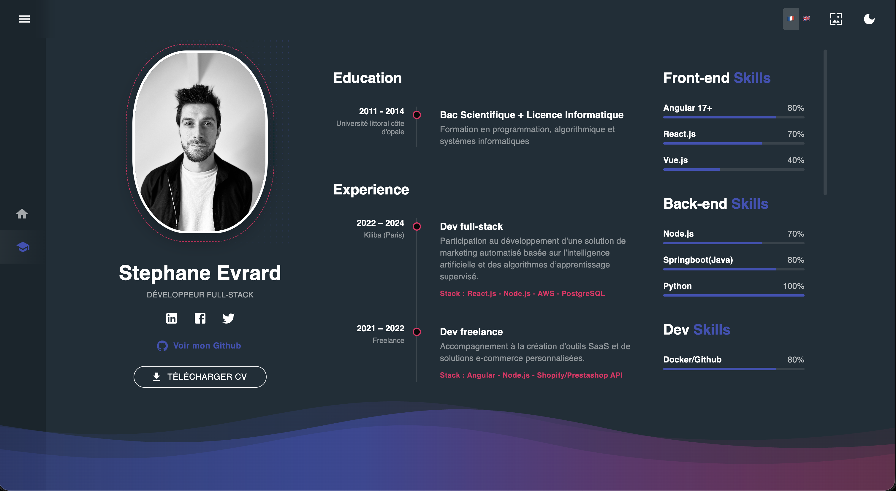

# 👨‍💻 Sevrard-react (Portfolio)

Application web type "Portfolio / CV Interactif" développée avec les dernières fonctionnalités de React 19. Elle intègre une gestion avancée des thèmes, une internationalisation complète et des animations fluides.

* 🔗 **Demo live** : https://app.fuky.synology.me

## 🚀 Stack technique

### 🖥️ Core & Frontend
* **React 19.2** (Hooks, Context API)
* **Vite** (Build tool ultra-rapide)
* **TypeScript** (Typage strict)
* **React-i18next** (Internationalisation FR/EN)

### 🎨 UI & UX
* **Material UI (v6)** (Bibliothèque de composants)
* **GSAP** (GreenSock Animation Platform pour les transitions complexes)
* **Emotion** (Styled components engine)
* **Responsive Design** (Mobile First)

### 🧱 Infra / DevOps
* **Docker** (Conteneurisation)
* **NAS Synology** (Auto-hébergement)
* **CI/CD** (Pipeline de déploiement automatisé)

## 🎨 Theming Avancé & Auto-Theme

L'application utilise un **Context Provider** personnalisé pour gérer l'apparence globale.

* 🌗 **Mode Sombre / Clair** : Bascule automatique ou manuelle.
* 🎨 **Palettes Dynamiques** : Injection de variables CSS (`--primary-color`, etc.) via MUI `createTheme`.
* **Thèmes disponibles** :
  * Pink & Blue Grey
  * Purple & Green
  * Indigo & Pink
  * Deep Purple & Amber

## 🌐 Internationalisation (i18n)

Support natif multi-langues (FR 🇫🇷 / EN 🇬🇧) :

* **Détection automatique** de la langue du navigateur.
* **Hot-swap** : Changement de langue instantané sans rechargement.
* Séparation des fichiers de traduction (`locales/fr.json`, `locales/en.json`).

## 📊 Fonctionnalités Clés

* 👤 **Profil & Bio** : Présentation dynamique.
* 🎓 **Timeline Expériences** : Visualisation chronologique des expériences pro.
* 🛠️ **Skill Bars & Badges** : Affichage graphique des compétences techniques (MUI LinearProgress & Chips).
* ⚡ **Animations GSAP** : Transitions d'entrée et effets de scroll fluides.
* 📱 **Navigation Responsive** : Sidebar adaptative et Drawer mobile.

## 👨‍💻 Auteur

**Stéphane Evrard**
Développeur Fullstack (Angular / React / Node / Java)
